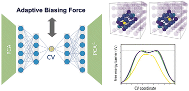

COllective Variables from AutoEncoders in Materials (COVAEM)
============================================================

Jacopo Baima, Mihai-Cosmin Marinica

contributors: 
Alexandra M. Goryaeva, Thomas D. Swinburne, Maylise Nastar, Jean-Bernard Maillet

This package was used in the paper: 

[Capabilities and limits of autoencoders for extracting collective variables in atomistic materials science](https://pubs.rsc.org/en/content/articlelanding/2022/cp/d2cp01917e)

Free energy calculations in materials science are routinely hindered by the need to provide reaction coordinates that can meaningfully partition atomic configuration space, a prerequisite for most enhanced sampling approaches. Recent studies on molecular systems have highlighted the possibility of constructing appropriate collective variables directly from atomic motions through deep learning techniques. Here we extend this class of approaches to condensed matter problems, for which we encode the finite temperature collective variable by an iterative procedure starting from 0 K features of the energy landscape i.e. activation events or migration mechanisms given by a minimum – saddle point – minimum sequence. We employ the autoencoder neural networks in order to build a scalar collective variable for use with the adaptive biasing force method. Particular attention is given to design choices required for application to crystalline systems with defects, including the filtering of thermal motions which otherwise dominate the autoencoder input. The machine-learning workflow is tested on body-centered cubic iron and its common defects, such as small vacancy or self-interstitial clusters and screw dislocations. For localized defects, excellent collective variables as well as derivatives, necessary for free energy sampling, are systematically obtained. However, the approach has a limited accuracy when dealing with reaction coordinates that include atomic displacements of a magnitude comparable to thermal motions, e.g. the ones produced by the long-range elastic field of dislocations. We then combine the extraction of collective variables by autoencoders with an adaptive biasing force free energy method based on Bayesian inference. Using a vacancy migration as an example, we demonstrate the performance of coupling these two approaches for simultaneous discovery of reaction coordinates and free energy sampling in systems with localized defects.

Please if using to cite the following paper: 

>Capabilities and limits of autoencoders for extracting collective variables in atomistic materials science, 
>J. Baima, A. M. Goryaeva, T. D. Swinburne, J. B. Maillet, M. Nastar, Maylise, M.-C. Marinica
>[10.1039/D2CP01917E](http://dx.doi.org/10.1039/D2CP01917E)
(2022)
